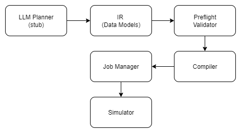

# LLM‑Driven Fluent Control Project: Phases and Code Architecture

This document summarizes the key phases of the project to enable natural‑language control of a Tecan Fluent liquid‑handling robot.  It is intended for new engineering team members who need to understand both the project plan and how the accompanying Python package is structured.  Citations point back to the Fluent documentation for record structures and worklist behaviour.

## Phase 1 – Contracts & Models

The first phase establishes a **shared contract** between the AI planner and the robot.  Without clear contracts, later steps become guesswork and unsafe.  You will:

1. **Enumerate capabilities and constraints.**  Fluent worklists consist of seven record types (Aspirate, Dispense, Wash tips / Replace DiTis, Flush, Break, Set DiTi Type and Comment).  Each record begins with a single character (`A`, `D`, `W`, `F`, `B`, `S`, `C`) and is followed by semicolon‑separated parameters.  Document the required and optional parameters for each record and capture physical limits (e.g. volume ranges, tip capacities, labware types).

2. **Define the intermediate representation (IR).**  The IR is a robot‑agnostic schema that describes *what* needs to be done.  It includes the job version, job ID, a list of steps, and job‑level constraints.  Each step has an identifier, an operation (`op`), arguments (`args`) and preconditions.  Our `fluent_robot/ir.py` module defines these dataclasses.  For example:

```python
from fluent_llm.ir import IRJob, IRStep

job = IRJob(
    version="1.0",
    job_id="example",
    name="Example transfer",
    steps=[
        IRStep(id="s1", op="transfer", args={
            "source_labware": "S1",
            "source_well": "A1",
            "dest_labware": "D1",
            "dest_well": "B1",
            "volume_uL": 50.0
        }, preconditions=["robot.homed == true", "tip.attached == true"])
    ],
    constraints={"require_homed": True}
)
```

3. **Establish an error taxonomy.**  Identify error conditions such as labware not found, volume out of range, unknown operations, etc.  The preflight validator uses these to detect problems before execution.

### Data Required from Fluent Documentation

To implement Phase 1 correctly you must extract from the official Fluent documentation:

* **Record parameter definitions** – what each field after the record type means and its valid values.  For example, the documentation shows that an aspirate record has parameters `RackLabel;RackID;RackType;Position;TubeID;Volume;LiquidClass;TipType;TipMask;ForcedRackType`.  Without these definitions you cannot map IR arguments to worklist fields.
* **Well numbering scheme** – numeric positions are computed by counting eight rows per column (A2 becomes position 9).
* **Volume and tip limits** – maximum and minimum volumes per tip type and labware, along with allowed liquid classes and wash schemes.
* **Error and warning behaviour** – FluentControl defines how to handle missing labware (skip, warn, stop).  These behaviours must be mirrored in the preflight validator and job manager.

## Phase 2 – Deterministic Execution

Once the contracts are defined, Phase 2 builds a **deterministic execution layer**.  This layer converts IR into a Tecan worklist and provides a dry‑run capability.

1. **Compiler:**  The `fluent_llm/compiler.py` module implements `compile_ir(job)` to translate each IR step into one or more `.gwl` lines.  For a transfer step it produces an `A` record (aspirate) and a `D` record (dispense).  It uses the helper `well_to_position()` to convert alphanumeric wells (A1–H12) into numeric positions; this function multiplies the column index by eight and adds the row index + 1, so `A2` becomes position 9.  The compiler currently supports three operations:
   * **transfer:** Generates `A` and `D` records with the specified labware, well positions and volume.
   * **wash:** Generates `W<scheme>;` lines.  The default scheme is 1, but the manual defines multiple wash schemes that you should enumerate.
   * **decontaminate:** Generates `WD;`, which performs a decontamination wash.

   The compiler is deliberately conservative: unknown operations result in a failure.  Many advanced commands (flush `F;`, break `B;`, set DiTi type `S;`) and additional parameters (e.g. liquid class, tip mask) are marked as TODOs.  They should be implemented once the necessary data is extracted from the manual.

2. **Preflight validator:**  Before compilation, `preflight_check(job, deck_state)` verifies that referenced labware exists, that volumes are within bounds, and that the operations are known.  It returns a list of errors; the job manager rejects jobs that fail.  In a future iteration the validator will perform context checks similar to FluentControl (e.g. skip vs. warn vs. error for missing labware).

3. **Simulator:**  The `fluent_llm/simulator.py` module provides a minimal dry‑run.  It tracks volumes in 96‑well plates and updates them according to transfer operations.  Wash and decontamination are logged but do not change state.  Real physical limits (e.g. 250 µL per well) and mixing behaviour are not modelled; consult the documentation and libraries like `robotools` [RobotTools Documentation](https://robotools.readthedocs.io/en/latest/robotools_fluenttools.html#robotools.fluenttools.worklist.FluentWorklist) to extend the simulator.

4. **Job manager:**  `fluent_llm/job_manager.py` orchestrates the process.  It holds a queue of IR jobs, runs preflight checks, compiles the worklists, simulates them and would, in a production system, dispatch them to the robot.  Recovery actions for different error types (abort, skip, retry) are configurable.

### Data Required from Fluent Documentation

* **Advanced command parameters** – `W` (wash), `WD` (decontaminate), `F` (flush), `B` (break), `S` (set DiTi type) and `R` (reagent distribution) each have specific parameter sets and side effects.  For example, `WD` performs a decontamination wash for fixed tips only.  The manual should specify the allowed schemes (W1, W2, etc.), the meaning of each parameter and when commands can be used.
* **Liquid class precedence** – In advanced worklists the liquid class defined in the file overrides the script’s liquid class.  The compiler must honour this rule.
* **Tip handling rules** – How to handle multiple tips, tip masks, dynamic tip handling and mixing commands.  Currently the compiler sets unspecified fields blank; you need to fill them according to the manual.

## Phase 3 – Safety & AI Integration (preview)

Phase 3 introduces the AI planner and safety policies:

* **LLM planner:**  A large language model converts user instructions into IR.  Our `fluent_llm/llm_stub.py` file contains a rudimentary parser that extracts transfer commands, wash and decontamination requests from free text.  In production this will be replaced by an LLM that emits JSON IR objects and handles validation errors via a repair loop.
* **Safety policies:**  Preflight checks will incorporate risk classification (allow / confirm / block) and enforce permissioning.  For example, decontamination may require operator confirmation.
* **Tool API (MCP):**  The robot API will be wrapped as a set of tools (e.g. `submit_job`, `validate_plan`, `get_state`), allowing the LLM to call them reliably.

## Code Architecture Diagram

The Python package mirrors the phased architecture.  The diagram below illustrates how the major sub‑systems interact:



* **LLM Planner (stub)** – Parses natural language into an IR job (Phase 3).  In this project we include only a stub for testing.
* **IR (Data Models)** – Defines the job and step schemas used throughout the system.
* **Preflight Validator** – Validates IR jobs against the deck state and policy (Phase 2).
* **Compiler** – Converts validated IR into `.gwl` lines (Phase 2).  This module is the primary consumer of Fluent documentation.
* **Job Manager** – Manages submission, queuing, compilation, simulation and (in a full system) execution (Phase 2/3).
* **Simulator** – Performs dry‑runs by updating volumes in virtual labware (Phase 2).  Useful for testing and debugging.

## Running the Example Workflow

To see these components in action, run the included `main.py` script.  It demonstrates how a natural‑language description is transformed into a worklist and simulated:

```bash
python3 main.py
```

You should see output similar to:

```
Task description: Transfer 50 uL from plate S1 A1 to plate D1 B1, wash, then decontaminate.

Generated IR job:
  s1 – op=transfer, args={...}
  s2 – op=wash, args={'scheme': 1}
  s3 – op=decontaminate, args={}

Compiled worklist lines:

A;S1;;;1;;50.00;Water;;;
D;D1;;;2;;50.00;Water;;;
W1;
WD;

Simulation state (delta volumes):
  S1: total volume = -50.0 µL
  D1: total volume = 50.0 µL
```

This proves the pipeline works end‑to‑end for a simple scenario.  To extend it, implement additional commands and validations according to the Fluent documentation.

## Phase 4 – Control APIs & Integration

Phase 4 introduces a formal API layer so that external systems (web UIs, schedulers,
multi‑agent orchestrators) can interact with the robot in a consistent way.
Rather than embedding control logic in scripts, you will expose a set of
endpoint‑like methods that wrap the core services (job manager, simulator and
capability registry).

| Sub‑task | Explanation | Example / Pseudocode |
| --- | --- | --- |
| **Design REST/gRPC endpoints** | Define the operations your API should expose: job submission (`POST /jobs`), job status queries (`GET /jobs/{id}`), control commands (`POST /jobs/{id}/pause|resume|abort`), robot state (`GET /robot/state`) and capability listing (`GET /capabilities`).  Each endpoint should have clear inputs, outputs and idempotency guarantees. | Pseudocode using FastAPI: see below. |
| **Build a job queue and lifecycle manager** | Your API should back onto a queue that can hold multiple pending jobs and execute them sequentially or concurrently. Track the status of each job (pending, running, paused, completed, aborted). Provide a method to retrieve this status. This manager sits beneath the API and is already implemented in `job_manager.py` but must be extended to expose status and pause/resume/abort methods. | Example logic: see below. |
| **Expose robot state and capabilities** | Provide an endpoint that returns the robot’s current state: deck layout, attached tips, queued job count and error conditions.  Also expose the `capabilities.yaml` registry via the API so that clients can discover supported commands and constraints. | In our code, `RobotAPI.get_robot_state()` returns a dictionary with `deck_state`, `queued_jobs` and `job_status`.  `RobotAPI.list_capabilities()` loads and returns the YAML registry. |
| **Handle errors and idempotency** | The API must handle invalid inputs gracefully (e.g. unknown job IDs, malformed IR jobs).  Use appropriate HTTP status codes (400 for bad request, 404 for not found) and ensure that re‑submitting the same job does not create duplicates.  Incorporate idempotency keys into your API design. | On repeated `POST /jobs` with the same client‑generated ID, return the existing job ID rather than creating a new one.  Return `404` if `GET /jobs/{id}` is called for an unknown job. |

Example FastAPI endpoints for the control API:

```python
from fastapi import FastAPI
from fluent_llm.api import RobotAPI  # adjust import to your package structure

app = FastAPI()
api = RobotAPI(job_manager)

@app.post("/jobs")
def submit_job(job: IRJob):
    job_id = api.submit_job(job)
    return {"job_id": job_id}

@app.get("/jobs/{job_id}")
def get_status(job_id: str):
    return {"status": api.get_job_status(job_id)}

@app.post("/jobs/{job_id}/pause")
def pause(job_id: str):
    api.pause_job(job_id)
    return {"status": "paused"}
```

Example logic for building a job queue and lifecycle manager:

```python
class JobManager:
    def submit(self, job):
        self.queue.append(job)
        self.job_status[job.job_id] = "pending"
    def run_next(self):
        job = self.queue.pop(0)
        self.job_status[job.job_id] = "running"
        # compile + execute
        self.job_status[job.job_id] = "completed"
    def status(self, job_id):
        return self.job_status.get(job_id)
```

**Deliverables for Phase 4**

* API skeleton implementing the endpoints with `FastAPI` or another framework.
* Extended `JobManager` supporting status tracking, pause, resume and abort.
* Integration tests covering typical workflows through the API.

## Phase 5 – Safety Policies & Risk Classification

In Phase 5 you will formalize safety policies that go beyond simple validation.
Where Phase 2 checks for missing labware or invalid volumes, Phase 5
determines whether an operation should proceed automatically, require
confirmation from a human operator or be blocked entirely.  The Tecan
documentation describes configurable behaviours when labware is missing (skip,
warn, error)【878924386749744†L112-L124】; your policy engine should generalize
this concept to all operations.

| Sub‑task | Explanation | Example / Pseudocode |
| --- | --- | --- |
| **Expand preflight validation** | Incorporate detailed labware definitions (well counts, volume capacities, allowed tip types), advanced command parameters (flush, break, set DiTi type) and dynamic checks (available tips, reagent volumes).  Use the capability registry to look up valid operations and enforce parameter ranges. | Pseudocode: see below. |
| **Implement risk classification** | Create a mapping from operations (and potentially their arguments) to risk levels: `allow`, `confirm`, or `block`.  For example, decontamination might be classified as `confirm` because it uses strong chemicals; high‑volume transfers could be `confirm` above a threshold; unknown commands are `block`. | Example in `policy.py`: see below. |
| **Enforce permissions** | Introduce user roles (e.g. operator, supervisor, admin) and link them to risk levels.  Only supervisors can confirm `confirm` operations; all users can run `allow` operations; nobody can execute `block` operations.  Integrate this check into the API and job manager. | Pseudocode: see below. |
| **Build confirmation workflows** | For operations classified as `confirm`, the system should pause execution and prompt the operator.  Store the confirmation status and resume the job once confirmed.  This requires persistence (e.g. database) and UI integration. | When the job manager encounters a `confirm` step, set the job status to `waiting_confirmation` and return a message through the API.  After confirmation, resume execution. |
| **Integrate environment simulation and checks** | Before executing a job, simulate it against real inventory (tip racks, reagent volumes) to ensure resources are sufficient.  This goes beyond the static dry‑run in Phase 2.  Fail early if resources are depleted. | Use or extend the simulator to track tip consumption and reagent depletion.  If a job requires more tips than available, return an error before starting. |

Pseudocode examples for Phase 5:

Pseudocode for preflight validation:

```python
def preflight_check(job, deck_state):
    errors = []
    for step in job.steps:
        # Unknown operation
        if step.op not in capabilities["capabilities"]:
            errors.append((step.id, ErrorType.UNKNOWN_OPERATION, "Unsupported op"))
        # TODO: check labware presence, tip availability and volume ranges here
    return errors
```

Example risk classification:

```python
RISK_POLICY = {"transfer": "allow", "wash": "allow", "decontaminate": "confirm"}

def classify_step(step: IRStep) -> str:
    # default to 'block' if the operation is not in the policy
    return RISK_POLICY.get(step.op, "block")
```

Pseudocode for enforce permissions:

```python
def authorize(step: IRStep, user_role: str) -> bool:
    level = classify_step(step)
    if level == "allow":
        return True
    if level == "confirm" and user_role == "supervisor":
        return True
    return False
```

**Deliverables for Phase 5**

* A `policy.py` module implementing risk classification and permission checks.
* Enhanced preflight validation that uses the capability registry.
* Integration with the job manager to pause for confirmation and enforce permissions.
* Unit tests covering classification, authorization and confirmation flows.

## Phase 6 – LLM Planning Layer

Phase 6 integrates a language model to convert natural‑language instructions
into IR.  While the initial prototype uses a simple parser, production
integration requires robust prompting, error handling and retrieval of
domain knowledge.

| Sub‑task | Explanation | Example / Pseudocode |
| --- | --- | --- |
| **Define prompt templates and tool interfaces** | Craft prompts that instruct the LLM to output JSON matching the IR schema.  Provide tool definitions for listing capabilities, validating plans and submitting jobs so that the model can call them appropriately.  Include example plans in the prompt. | Example prompt fragment: see below. |
| **Implement a structured output parser** | Parse the LLM's JSON output into an `IRJob`.  Validate it against the IR schema and the capability registry.  Reject plans that are not valid JSON or that contain unknown fields. | Pseudocode: see below. |
| **Add a repair loop** | When validation fails, send a structured error message back to the LLM and request a corrected plan.  Limit the number of retries to avoid infinite loops. | Pseudocode: see below. |
| **Integrate RAG (retrieval‑augmented generation)** | Provide the LLM with additional context such as labware definitions, worklist syntax, SOPs and examples by retrieving relevant documents and injecting them into the prompt.  This reduces hallucinations and improves correctness. | Use a document store (e.g. vector database) to retrieve passages from the Fluent manual about record parameters and volumes.  Insert them into the context section of the prompt before calling the LLM. |
| **Fallback strategies** | Define what happens if the LLM cannot produce a valid plan after multiple attempts: either ask the user for clarification, default to a safe subset of operations, or refuse the job. | If the repair loop exceeds 3 attempts, return a message to the user asking for a more precise description or suggesting manual worklist upload. |

Example prompt and pseudocode for Phase 6:

Example prompt fragment for the LLM:

```
You are controlling a Tecan Fluent robot.  Output JSON matching this schema:
{"version": str, "job_id": str, "steps": [ ... ], "constraints": {...}}
Only use operations from this list: transfer, wash, decontaminate.
```

Pseudocode for a structured output parser:

```python
def parse_llm_response(json_str: str) -> IRJob:
    data = json.loads(json_str)
    job = IRJob(**data)
    validate(job)  # check schema
    return job
```

Pseudocode for a repair loop:

```python
for attempt in range(3):
    job = call_llm(prompt)
    errors = preflight_check(job, deck_state)
    if not errors:
        break
    prompt += f" The plan failed due to {errors}; please correct it."
```


**Deliverables for Phase 6**

* A new `llm_integration.py` module wrapping the LLM API, with functions to generate and repair IR jobs.
* Prompt templates and tool definitions for the LLM.
* Integration tests exercising valid and invalid plan generations.
